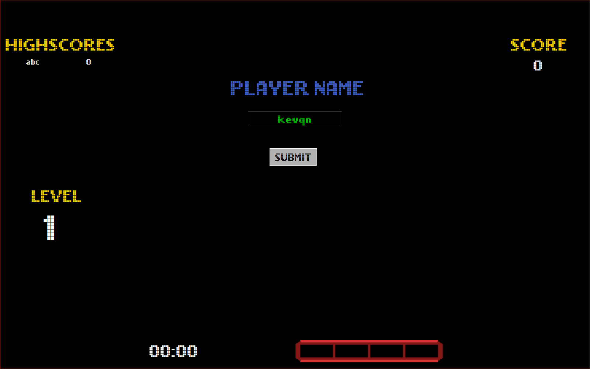
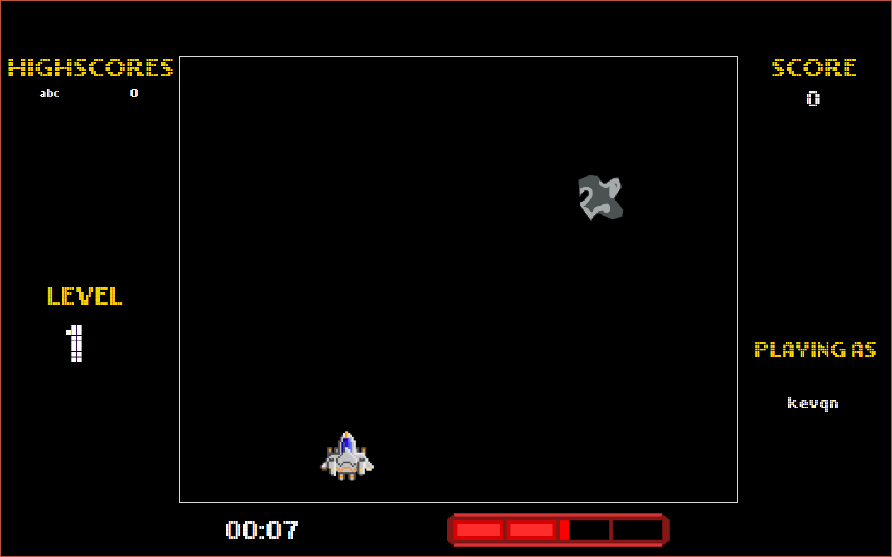

This project brings back memories from when coding was actually fun.

# asteroid-game

A fun little game I made for my 12th practical project.

# Usage

Just clone it and do `python run.py`

I don't think I need to explain how the game works.

# Screenshots

